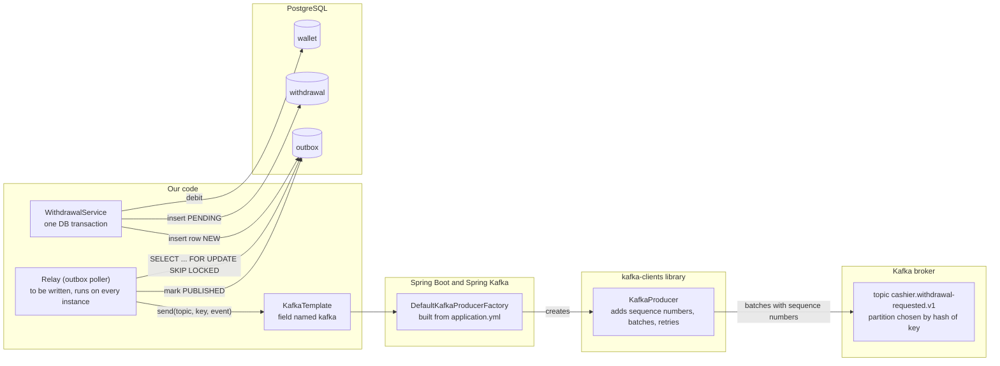
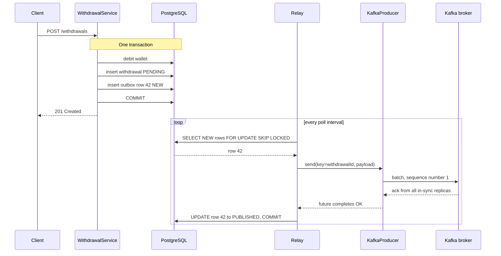
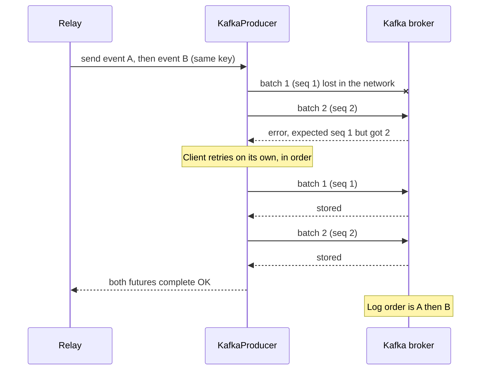
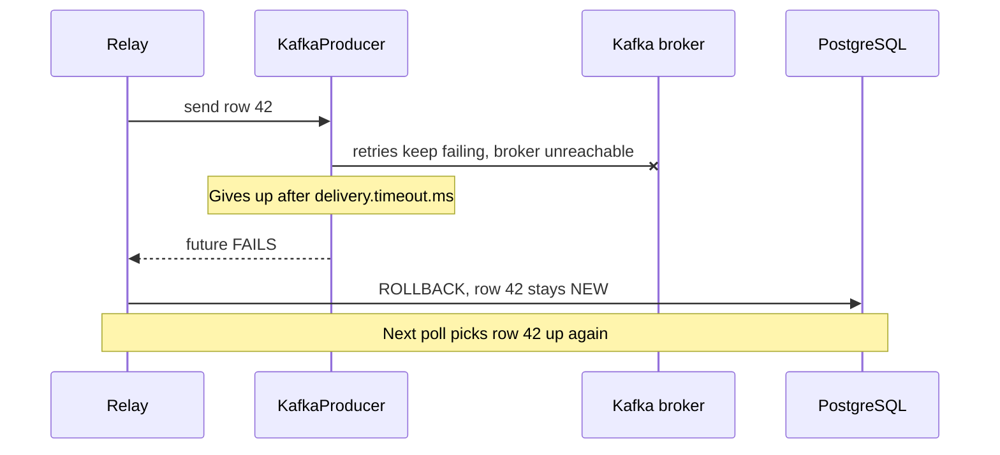
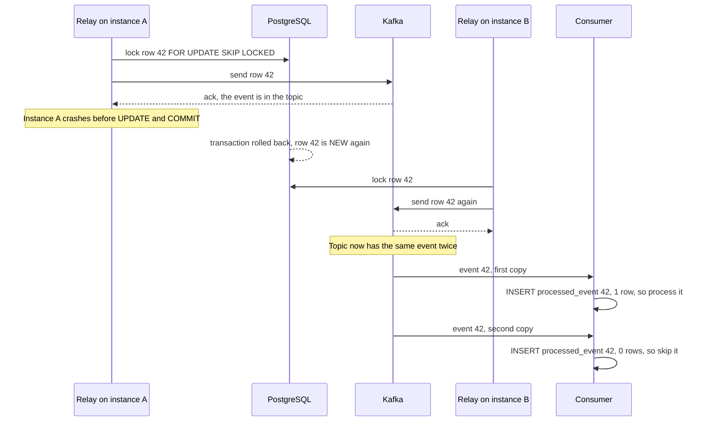
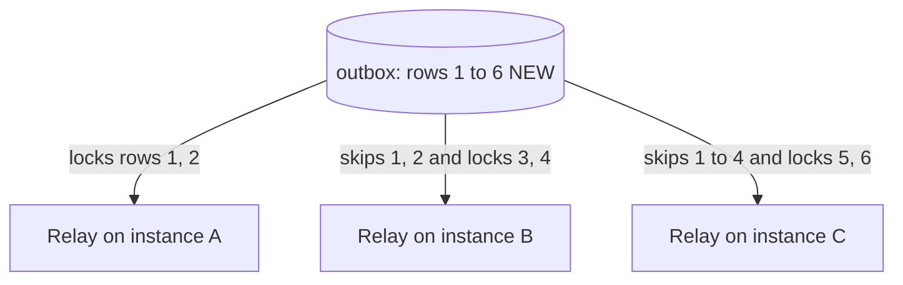

# Transactional outbox: how the pieces fit together

This describes the **proposed** design. The relay and the outbox table do not exist in the code yet.

## 1. Components and who owns them

## 2. Happy path

## 3. Out-of-order batches: handled inside the Kafka client, the relay never sees it

## 4. When the relay does see a failure

## 5. The duplicate: crash after Kafka acknowledged

## 6. Three instances sharing the work with SKIP LOCKED

## Where each setting lives

| Thing | Where | Who acts on it |
|---|---|---|
| `acks: all`, `enable.idempotence: true` | `application.yml` | Spring Boot passes them to KafkaProducer |
| Message key (withdrawal id) | second argument of `kafka.send(...)` | Kafka picks the partition from its hash |
| Sequence numbers, in-order retries | inside `kafka-clients` | KafkaProducer and the broker, not our code |
| Unique event id for deduplication | we put it in the message, for example the outbox row id | Consumer checks it |
