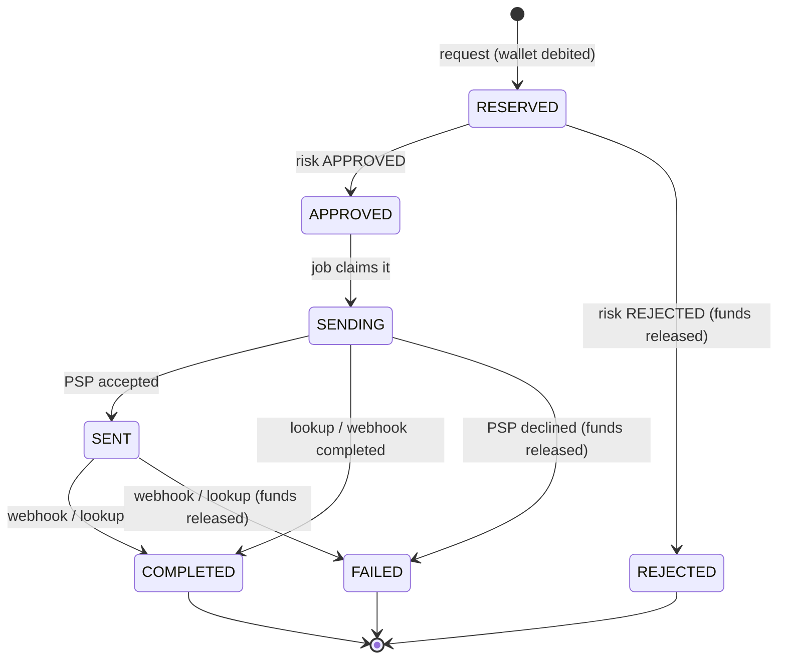

# Round 03: Reference implementation (teaching round)

This round is **not** a bug hunt. It is a small payouts service written the way you would want to see it in a
payments code review, with every important decision explained in the code next to it.

- Comments starting with **`WHY:`** explain a design decision.
- Comments starting with **`PAY ATTENTION:`** list what a reviewer checks and what usually goes wrong.
- `./mvnw test` runs 27 tests on **real MySQL 8.4 and real Kafka** (Testcontainers). Every behaviour described
  below is proven by a test.

Use it in two ways: read it once like a textbook (order below), then use the checklists at the end as the
mental model you compare interview code against.

---

## 1. The business flow

A player withdraws money from their casino wallet to a saved bank account or e-wallet.

1. **Request** (`POST /api/v1/withdrawals`): the amount plus a fee is **reserved** (debited) from the wallet at
   once. Status `RESERVED`.
2. **Risk / AML review**: the risk service publishes a decision on Kafka. `APPROVED` moves on; `REJECTED`
   releases (refunds) the reserved money.
3. **Payout**: a scheduled job claims approved withdrawals and asks the PSP to pay. Status `SENDING`, then `SENT`.
4. **Outcome**: the PSP tells us by **webhook** (`COMPLETED` or `FAILED`). If the webhook never comes, or the PSP
   call timed out, the job **asks the PSP** (lookup) instead of guessing.
5. Every state change writes an **event** to the outbox; a relay publishes it to Kafka for other teams.



**Why reserve first and pay later:** a debit can be refunded; a bank transfer that left cannot be recalled.
If anything breaks after the reservation, the worst case is a delay, never lost money.

## 2. Architecture

```mermaid
flowchart LR
    Client -->|POST withdrawal + Idempotency-Key| Controller[WithdrawalController]
    Controller --> Service[WithdrawalService<br/>no transaction]
    Service -->|one short tx| Tx[WithdrawalTransactions<br/>@Transactional]
    Tx --> DB[(MySQL<br/>wallet, withdrawal,<br/>ledger_entry, outbox_event)]
    Risk[Risk service] -->|risk.withdrawal-decisions.v1| Listener[RiskDecisionListener]
    Listener --> Handler[RiskDecisionHandler<br/>@Transactional + processed_event]
    Handler --> Tx
    Job[PayoutProcessor<br/>ShedLock] -->|claim / record result| Tx
    Job -->|HTTP, no tx, Idempotency-Key| PSP[(PSP)]
    PSP -->|signed webhook| Webhook[PspWebhookController]
    Webhook --> WebhookHandler[PspWebhookHandler] --> Tx
    Relay[OutboxRelay<br/>ShedLock] -->|reads NEW rows| DB
    Relay -->|payouts.withdrawal-events.v1<br/>key = playerId| Kafka[(Kafka)]
```

**The one rule behind the layout:** remote calls (PSP, Kafka) happen **between** short database transactions,
never inside one. All database transactions live in one bean, `WithdrawalTransactions`, and are always called
from another bean, so `@Transactional` really applies.

## 3. Reading order

| # | File | What it teaches |
|---|---|---|
| 1 | `money/Money.java` | BigDecimal + Currency, scale per currency, reject extra decimals, round once, safe equality |
| 2 | `domain/WithdrawalStatus.java` | State machine with allowed predecessors; final states never move |
| 3 | `repository/WalletRepository.java` | Atomic conditional debit, row count, `MANDATORY` propagation, bulk-update caveats |
| 4 | `repository/WithdrawalRepository.java` | Guarded transitions, idempotency key scoped per player, ownership in the query |
| 5 | `service/WithdrawalTransactions.java` | Transaction boundaries; "transition first, side effects after"; refund exactly once |
| 6 | `service/WithdrawalService.java` | Validation in the domain, idempotent replay, currency check, catching a duplicate outside the transaction |
| 7 | `psp/PayoutResult.java`, `psp/HttpPspPayoutClient.java` | Unknown outcomes as a type; PSP idempotency key; mapping HTTP errors is a money decision |
| 8 | `service/PayoutProcessor.java` | Claim → call → record; resolver for unknown outcomes; ShedLock plus claim |
| 9 | `web/WebhookSignatureVerifier.java`, `web/PspWebhookController.java`, `service/PspWebhookHandler.java` | Raw-body HMAC, constant-time compare, replay window, verify before acting |
| 10 | `messaging/RiskDecisionListener.java`, `service/RiskDecisionHandler.java`, `domain/ProcessedEvent.java` | Idempotent Kafka consumer, no catch-and-log, the `Persistable` trap |
| 11 | `config/KafkaConfig.java` | `DefaultErrorHandler`, backoff, explicit DLT, non-retryable errors |
| 12 | `messaging/OutboxWriter.java`, `messaging/OutboxRelay.java`, `domain/OutboxEvent.java` | Transactional outbox; ordered relay; timeouts aligned with the producer |
| 13 | `web/WithdrawalController.java`, `web/ApiExceptionHandler.java`, DTOs | REST contract: required key, 201/200, ProblemDetail, money as strings |
| 14 | `application.yml`, `db/migration/V1__init.sql` | Producer/consumer settings, OSIV off, Flyway + validate, constraints as the last line of defence |
| 15 | `src/test/...` | How to test all of the above on real infrastructure |

---

## 4. Concepts you asked about

### 4.1 What "atomic" means
**Atomic = all or nothing, and nobody can see or act in the middle.** Two meanings matter:

1. **An atomic statement:** `UPDATE wallet SET balance = balance - 102.50 WHERE id = 7 AND balance >= 102.50`
   checks and writes in **one step**. While it runs, the row is locked; a second request cannot slip in between
   "check" and "write". Compare with the non-atomic version:
   ```java
   Wallet w = repo.findById(7);                 // step 1: read 500
   if (w.balance >= 102.50) {                   // step 2: check (another request reads 500 too!)
       w.balance = w.balance - 102.50;          // step 3: write 397.50 (both write 397.50: one debit lost)
   }
   ```
   Between step 1 and step 3 anything can happen. That gap is called a **check-then-act race**.
2. **An atomic transaction:** several statements commit together or not at all. In `WithdrawalTransactions.reserve`
   the debit, the withdrawal row, the ledger row and the outbox row are one transaction: if the outbox insert
   fails, the debit is rolled back too. You never get "money taken, no withdrawal recorded".

What is **not** atomic, and therefore needs a pattern: a database commit plus a Kafka send (outbox), a database
commit plus an HTTP call to a PSP (claim, idempotency key, resolver).

### 4.2 Isolation levels, explained simply
Isolation decides **what a transaction sees of other transactions that run at the same time**.

| Level | What a plain `SELECT` sees |
|---|---|
| READ UNCOMMITTED | Even uncommitted changes of others (dirty reads). Never use for money |
| READ COMMITTED | The latest **committed** data **at the moment of each statement**. Two SELECTs in one transaction can see different values |
| REPEATABLE READ | A **snapshot** taken at the first read; the transaction keeps seeing that snapshot, even if others commit changes |
| SERIALIZABLE | As if transactions ran one after another. Strongest, slowest, needs retries |

Defaults: **MySQL InnoDB = REPEATABLE READ**; PostgreSQL, Oracle, SQL Server = READ COMMITTED.

**The key MySQL point ("plain SELECT is a snapshot; UPDATE and locking reads see the latest row"):**
```sql
-- Session A (REPEATABLE READ)            -- Session B
BEGIN;
SELECT balance FROM wallet WHERE id = 7;  -- 500 (snapshot taken now)
                                          BEGIN; UPDATE wallet SET balance = 200 WHERE id = 7; COMMIT;
SELECT balance FROM wallet WHERE id = 7;  -- still 500  (snapshot, stale!)
SELECT balance FROM wallet WHERE id = 7 FOR UPDATE;   -- 200 (locking read: latest committed)
UPDATE wallet SET balance = balance - 100 WHERE id = 7 AND balance >= 100;  -- works on 200 -> 100
```
So on MySQL:
- A Java check based on a plain `SELECT` can be **stale for the whole transaction**. If you then write a value
  computed in Java (`SET balance = :newValue`), you silently overwrite B's change: a **lost update**. MySQL does
  not raise an error for this (PostgreSQL at REPEATABLE READ would).
- `UPDATE ... WHERE balance >= :amount` and `SELECT ... FOR UPDATE` always read the latest committed row and lock
  it. That is why this project's guards are conditional updates.

**"Isolation is not a fix by itself"** means: don't answer a race with "raise the isolation level". Higher levels
behave differently per database (MySQL SERIALIZABLE takes shared locks and deadlocks; PostgreSQL SERIALIZABLE
aborts with serialization errors you must retry), and they hide the real problem. Name the row two writers share
and guard it explicitly: a conditional update, a lock, `@Version`, or a unique constraint.

### 4.3 `@Lock(PESSIMISTIC_WRITE)` and the alternatives
`@Lock(LockModeType.PESSIMISTIC_WRITE)` on a repository query makes JPA read the row **with a write lock**:
`SELECT ... FOR UPDATE` on MySQL/PostgreSQL/Oracle (`WITH (UPDLOCK, ROWLOCK)` on SQL Server). Any other
transaction that wants to lock or update that row **waits** until yours commits or rolls back.

```java
@Lock(LockModeType.PESSIMISTIC_WRITE)
@QueryHints(@QueryHint(name = "jakarta.persistence.lock.timeout", value = "3000"))  // don't wait forever
@Query("select w from Wallet w where w.id = :id")
Optional<Wallet> findByIdForUpdate(@Param("id") Long id);

@Transactional
public void debit(Long walletId, Money amount) {
    Wallet w = wallets.findByIdForUpdate(walletId).orElseThrow();   // row locked until commit
    if (w.balance().amount().compareTo(amount.amount()) < 0) throw ...;
    w.debit(amount);                                                // dirty checking writes it at commit
}
```

| Option | How it works | Use it when | Costs / traps |
|---|---|---|---|
| **Conditional UPDATE** (used here) | Check + write in one statement; check the row count | One row, a simple condition (balance ≥ x, status = y). Hot rows | Must check the count; bulk JPQL bypasses `@Version` and the persistence context |
| **Pessimistic lock** (`PESSIMISTIC_WRITE`) | Lock the row on read, decide in Java, write | The decision needs several reads or complex rules, or several rows must stay consistent; high contention where retries would be wasteful | Others wait; deadlocks if two transactions lock rows in different orders (lock in a fixed order, e.g. by id); set a lock timeout; keep the transaction short and never call remote services while holding it |
| **`PESSIMISTIC_READ`** | Shared lock (`FOR SHARE`): others can read-lock but not write | You must make sure a row doesn't change while you use it, without changing it yourself | Two readers that both later write can deadlock |
| **`NOWAIT` / `SKIP LOCKED`** (lock timeout hint 0 / -2 in Hibernate) | Fail immediately / skip rows someone else holds | Job queues: several workers taking different rows (MySQL 8+, PostgreSQL, Oracle; SQL Server `READPAST`) | Skipping breaks ordering across workers |
| **Optimistic lock** (`@Version`) | No lock; the update includes `WHERE version = ?` and fails if someone changed the row | Low contention; long "think time" (user edits a form); aggregates updated through the entity | Throws `ObjectOptimisticLockingFailureException`; you must **retry the whole transaction outside it**; many retries on hot rows |
| **Unique constraint** | The database refuses the second insert | "Only once" rules: idempotency keys, one refund per payment, processed event ids | Catch the violation **outside** the failed transaction |
| **Distributed lock** (ShedLock, Redis) | A lease shared by instances | Single-runner jobs | A lease can expire while you still work; make the work itself safe to run twice |

Rule of thumb for interviews: *"For a balance I use a conditional update and check the row count. If the decision
needs more than one row or complex logic, a pessimistic lock with a timeout, rows locked in a fixed order, short
transaction. Optimistic locking for low-contention aggregates, retried outside the transaction. In-JVM locks never,
because we run several instances."*

---

## 5. What to pay attention to (the checklist, mapped to this code)

### Money
- [ ] `BigDecimal` + `Currency` (here: `Money`), never `double`. Created from strings or `BigDecimal`.
- [ ] Scale from the currency; extra decimals **rejected**, not rounded away (`Money` constructor).
- [ ] `compareTo` on raw `BigDecimal`; `equals` only on normalised values (`Money` record).
- [ ] Every division has a scale and a rounding mode; round **once** (`Money.percentage`).
- [ ] Per-currency configuration (`payouts.fee.minimum`), unsupported currencies rejected (`FeePolicy`).
- [ ] Request currency equals the wallet currency (`WithdrawalService`).
- [ ] Money in JSON as strings with a currency (`WithdrawalResponse`, `WithdrawalEvent`).
- [ ] DB columns `DECIMAL(19,4)` and CHECK constraints as a last line of defence (`V1__init.sql`).

### Concurrency
- [ ] Every read-then-write is guarded: conditional update + row count (`debitIfSufficient`, `transition`).
- [ ] The early Java balance check is only a fast path; the SQL condition is the guard.
- [ ] State changes go through guarded transitions; side effects only when the transition returned 1.
- [ ] "Exactly once" comes from the database (transition, unique constraints), not from Java flags.
- [ ] Jobs on several instances: ShedLock **and** an atomic claim (`claimForSending`), so overlap is harmless.
- [ ] No `synchronized`, in-memory maps or caches pretending to be global state.
- [ ] Tests: latch-based concurrent tests asserting invariants on a real database.

### Transactions
- [ ] Transaction methods live in a separate bean and are called through the proxy (no self-invocation).
- [ ] No network call inside a transaction (PSP and Kafka calls are between transactions).
- [ ] Unchecked exceptions for business errors, so `@Transactional` rolls back (`PayoutException`).
- [ ] `Propagation.MANDATORY` where a write must never run alone (`WalletRepository`, `OutboxWriter`).
- [ ] A constraint violation is caught **outside** the failed transaction (`WithdrawalService`, listener).
- [ ] `spring.jpa.open-in-view: false`; `ddl-auto: validate`; schema by Flyway.
- [ ] Bulk updates: `clearAutomatically`/`flushAutomatically`, then re-read.

### Idempotency and payment flow
- [ ] `Idempotency-Key` required, scoped per player, unique in the DB, payload compared on replay (201 vs 200).
- [ ] The PSP gets our stable merchant reference as **its** idempotency key on every attempt.
- [ ] Timeout, 5xx, connection reset = **Unknown**: no refund, no blind resend; resolve by lookup (`PayoutProcessor`).
- [ ] Reserve first, pay later; release funds exactly once on rejection or failure.
- [ ] Webhooks: raw-body HMAC, constant-time compare, timestamp window, verify the amount **before** acting,
      2xx for duplicates, late events cannot undo final states.
- [ ] Append-only ledger written in the same transaction as each balance change.

### Kafka
- [ ] Producer: `acks=all`, `enable.idempotence=true`, `delivery.timeout.ms` shorter than any wait in the relay.
- [ ] Outbox written in the business transaction; relay publishes in id order, waits for the ack, stops on failure.
- [ ] Key = the entity whose order matters (player id); order is per partition only.
- [ ] Consumer: commits after processing (`ack-mode: record`), `auto-offset-reset: earliest`.
- [ ] Idempotent consumer: processed event id inserted in the same transaction as the effect.
- [ ] No catch-and-log in listeners; `DefaultErrorHandler` + backoff + explicit DLT; bad messages not retried.
- [ ] Events: schema version, money as strings, no personal data.

### API and security
- [ ] DTOs with `@Valid`; the domain validates again.
- [ ] Player id from the gateway, ownership checked in queries (404 for others' resources).
- [ ] One error format (ProblemDetail + stable code); no broad `IllegalArgumentException` → 400 mapping.
- [ ] Secrets from the environment, no defaults; no PII or card data in logs; actuator restricted.

### Operations
- [ ] Every remote call has timeouts.
- [ ] Metrics for unknown outcomes, webhook mismatches, processor errors (`payouts.*` counters); alert on them and
      on withdrawals stuck in `SENDING`/`SENT`.

---

## 6. Where the bugs from Rounds 1 and 2 are prevented here

| Round bug | Prevented in |
|---|---|
| Ignored debit result (R1) | `WithdrawalTransactions.reserve` throws when `debitIfSufficient` returns 0 |
| Missing `@Valid`, negative amounts (R1) | `@Valid` in the controller **and** `WithdrawalService.toMoney` |
| Currency not checked against the wallet (R1) | `WithdrawalService.request` |
| Fee rate rounded early (R1) | `Money.percentage` rounds once |
| `divide` without scale, `double` rates (R1) | No FX here; `Money` never divides without scale |
| Scale 2 for every currency (R1) | `Money` takes digits from `Currency`; columns `DECIMAL(19,4)` |
| Remote call under a row lock (R1) | `PayoutProcessor`: claim tx → PSP call → result tx |
| `BigDecimal.equals` in replay (R1) | `Withdrawal.isSameRequestAs` uses normalised `Money` |
| Kafka send after commit can be lost (R1) | Outbox + `OutboxRelay` |
| Self-invocation of `@Transactional` (R2) | All transactions in `WithdrawalTransactions`, always called from other beans |
| Duplicate webhook race (R2) | Guarded transitions (`complete`, `failAndRelease`) |
| Timeout marked as FAILED (R2) | `PayoutResult.Unknown`, resolver with lookup |
| Retries without PSP idempotency key (R2) | `Idempotency-Key` header on every payout call |
| Lost update on wallet credit (R2) | Wallet changes only through conditional JPQL updates |
| Reconciliation without age threshold / on every replica (R2) | `stuckAfter` + ShedLock + claim |
| Idempotency key not scoped to player (R2) | `findByPlayerIdAndIdempotencyKey`, unique `(player_id, idempotency_key)` |
| Verify after acting, checked exception commits (R2) | `PspWebhookHandler` verifies first; `PayoutException` is unchecked |
| `String.equals` on signatures, secret in YAML (R2) | `MessageDigest.isEqual`; `${PSP_WEBHOOK_SECRET}` without default |
| PII in logs (R2) | Handlers log ids and statuses only |
| Optional idempotency key (R2) | Header required; missing key is a 400 |

---

## 7. Deliberately out of scope (and what you would add)

- **FX conversion**: payouts are in the wallet currency. Cross-currency payouts need a stored rate, its timestamp,
  `divide(rate, digits, mode)` and one rounding rule (see `.answer-keys/round-01-solution`).
- **Authentication**: assumed at the gateway (`X-Player-Id`). In production the service would also verify a signed
  token, not trust a plain header from anywhere.
- **Responsible gambling / AML rules** live in the risk service; this service only consumes its decision.
- **Daily reconciliation** against PSP settlement files, and an alert on rows stuck in `SENDING`/`SENT`.
- **Resilience4j** circuit breaker around the PSP client (fail fast when the PSP is down; never "assume success").
- **Correlation ids / tracing** (Micrometer Tracing + OpenTelemetry) and structured logs.
- **Outbox cleanup** (delete or archive `PUBLISHED` rows after N days).

## 8. Running it

```bash
./mvnw test          # needs Docker; starts MySQL 8.4 and Kafka 3.8 containers
```
Notes for this environment: Testcontainers is pinned to 1.21.4 (Docker Engine 29 needs it). If Docker Hub
rate-limits the MySQL pull, `docker pull mirror.gcr.io/library/mysql:8.4 && docker tag mirror.gcr.io/library/mysql:8.4 mysql:8.4`.

## 9. Saying it in the interview (one paragraph)

> "Money is a value object with the currency's scale. Every balance change and state change is a conditional
> update whose row count I check, inside one short transaction that also writes the ledger row and an outbox
> event. Remote calls happen between transactions: I claim the row, call the PSP with an idempotency key, and
> record the result; a timeout is an unknown outcome that I resolve by asking the PSP, never by refunding or
> resending blindly. Kafka consumers are idempotent on an event id stored in the same transaction, errors go
> through a DefaultErrorHandler to a DLT, and the outbox relay publishes in order, keyed by player. Jobs use
> ShedLock, but correctness never depends on the lock, only on the database guards."
